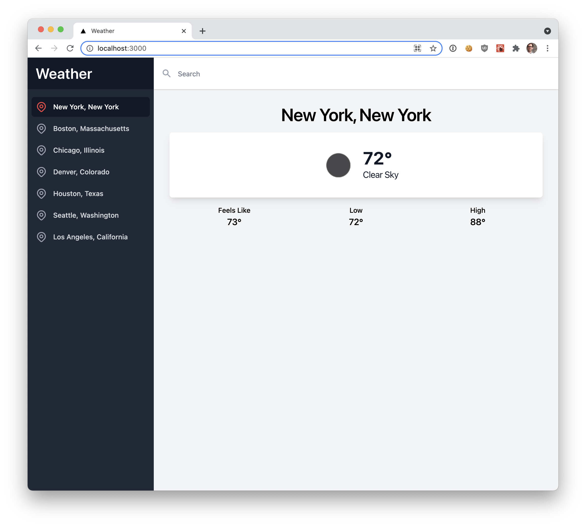
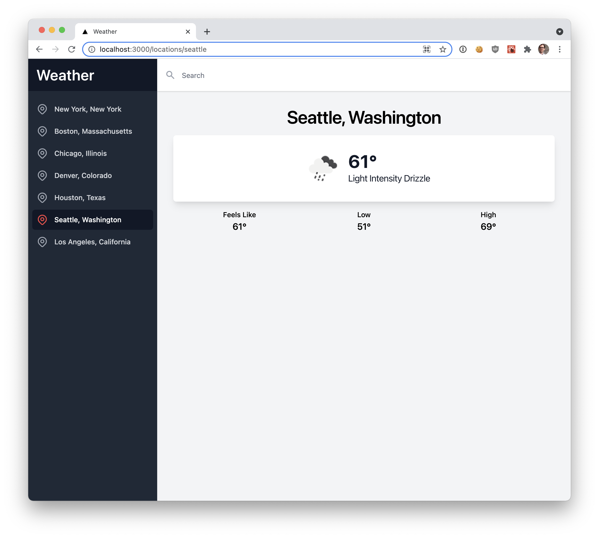

# README

Punchbowl-Weather displays the current weather using the free [OpenWeather API](https://openweathermap.org/).
The user may choose from a list of preset locations.

The application uses a Ruby on Rails backend API located in the `backend` directory and a Next.js frontend located in
the `frontend` directory.

For this challenge, you will be extending the weather application by adding new models and
API endpoints in the backend and updating the frontend to use those endpoints.
[Setup](#setup) and challenge instructions ([Step 0](#step0), [Step 1](#step1), [Step 2](#step2), [Step
3](#step3), [Step 4](#step4)) are below. Please complete all steps.

This is not a timed exercise, but expect it to take 2-3 hours to complete. You are free to take as much or as little 
time as you would like. You will be graded on completing and returning the project by the deadline, completing
the required steps, and the overall quality.

## Returning your challenge

To return your code challenge:

1. Remove the `node_modules` directories
2. Archive your project as `.zip` or `.tar.gz` file.
3. Email your archived project to your recruiting contact. You may need to upload your
archive to a file sharing service like Dropbox or Google Drive.

# Setup
## Dependencies

This application requires:

* Ruby v3.1+
* Node v16+
* yarn (or npm)

See the [Ruby on Rails Installation Guide](https://guides.rubyonrails.org/getting_started.html#creating-a-new-rails-project-installing-rails)
for more information about installing Ruby.

The is a monorepo with the following directories:

* `backend` – Rails 7.0 API application
* `frontend` – Next.js v12 application (React, Typescript, and TailwindCSS)

## Backend

### Install

Run the following steps in the `backend` directory.

```bash
bundle install
```

Run migrations to initialize the sqlite database.

```bash
bin/rails db:migrate
```

### Tests

Validate your installation by running the tests.

```bash
❯ bin/rake test
Running 6 tests in a single process (parallelization threshold is 50)
Run options: --seed 52093

# Running:

...S..

Finished in 1.020407s, 5.8800 runs/s, 9.8000 assertions/s.
6 runs, 10 assertions, 0 failures, 0 errors, 1 skips

You have skipped tests. Run with --verbose for details.
```

### Development Server

Run the Rails server on port 3001 using following command.

```bash
❯ bin/rails server -p 3001
=> Booting Puma
=> Rails 7.0.4 application starting in development 
=> Run `bin/rails server --help` for more startup options
Puma starting in single mode...
* Puma version: 5.6.5 (ruby 3.1.2-p20) ("Birdie's Version")
*  Min threads: 5
*  Max threads: 5
*  Environment: development
*          PID: 84298
* Listening on http://127.0.0.1:3001
* Listening on http://[::1]:3001
Use Ctrl-C to stop
```

## Frontend

### Install

Run the following steps in the `frontend` directory.

```bash
yarn install
```

### Development Server

Run the development server on port 3000 using the following command.

```bash
yarn run dev
```

At this point, you should be able to connect to the weather app at:

<a href="http://localhost:3000" target="_blank">http://localhost:3000</a>.


# Challenge

## <a name="step0"></a> Step 0: Set up a git repository

This monorepo is not currently a git repository. Set up a local git repository and track your changes in this challenge.

## <a name="step1"></a> Step 1: Move the static Locations data to the database

The locations data is static at `Location::LOCATIONS`. Update the `Location` model to read and write
data to the database. Add a rake task to insert the static data into the database.

## <a name="step2"></a> Step 2: Create a Locations API endpoint in the backend and use the Locations API in the frontend

Add an API endpoint to the backed to return the location data from the `Location` model. Make the
necessary changes in the model, controller, and tests.

Update the frontend to use the new Locations API.

  * The sidebar should show all of the locations from the API
    
  * The application should be able to show the current weather
    for all locations.
    

## <a name="step3"></a> Step 3: Allow users to mark multiple cities as favorites

Allow a user to mark multiple cities as favorites. Make the necessary changes or additions to models, controllers, and tests.
The front-end for this feature is partially built with sections commented out. Update the front-end
to display the favorites with a star in the sidebar and a button on the page to mark the currently
selected location as a favorite.

For this step, don't worry about authentication. You can assume `User.first` is the current user. Focus on the
feature itself rather than prerequisites or boilerplate to support the feature in a real-world environment.

## <a name="step4"></a> Step 4: Weather API rate-limiting and optimization

Suppose that our weather app is very popular with a large number of concurrent
users and only a limited number of supported locations. The third-party OpenWeather API
is rate-limiting us which is causing our API to throw errors. Can you create a solution
in Rails or Next.js that will resolve the API rate-limit issues while also improving our
app or API performance?
